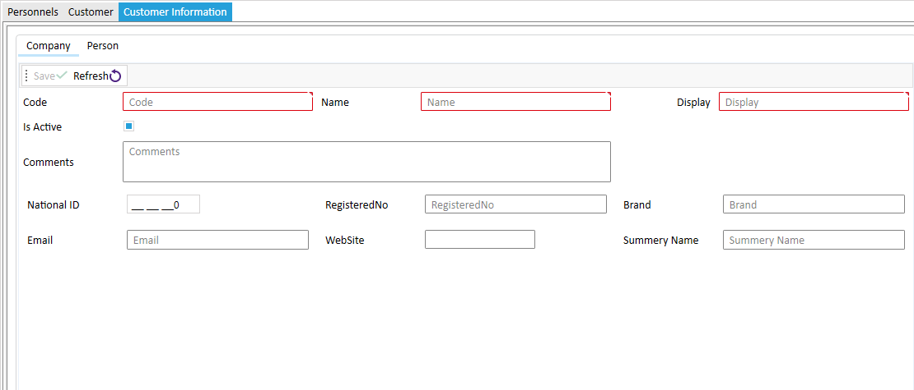
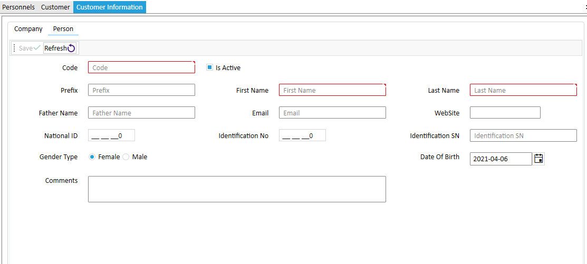

# Customer
**Note:** A custom is either in two parts of a person or a company, which is filled according to the needs of one of these two tabs of information.
The image below is company information :

The image below is company information :

To add the address details, the contact number of the fields of activity must save the company or person, then edit the desired record and fill in the rest of the tabs and save.

