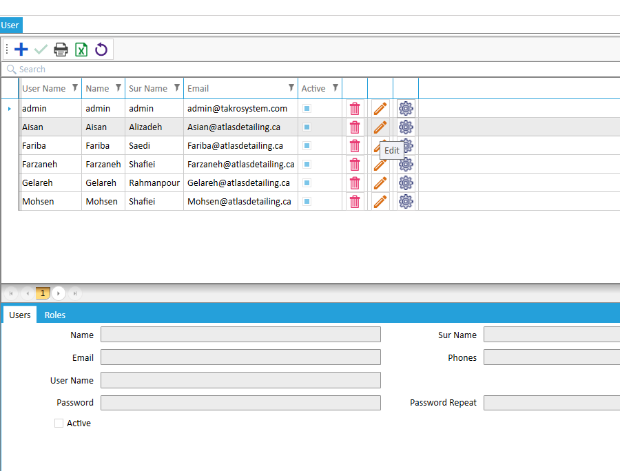
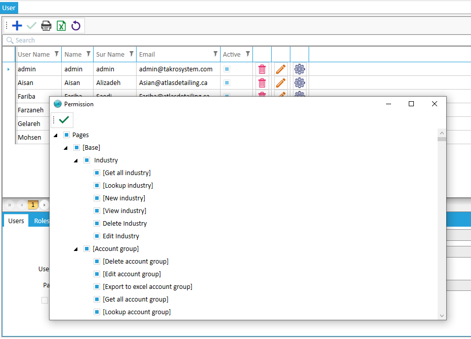

# User
**Note:**  The definition of system users is done from this section, which must be assigned to the desired roll to apply access levels.  The image below shows the user definition:

Also, if you need to reduce or increase a special access level that does not match the roll, you can apply from the Permissions like the image below:

