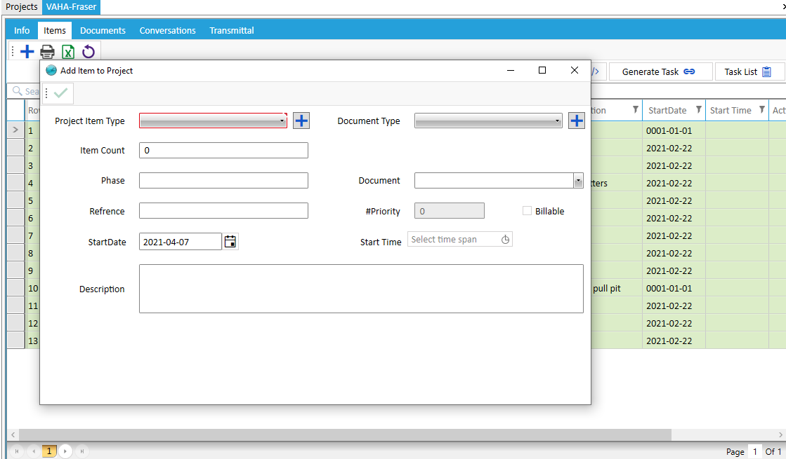
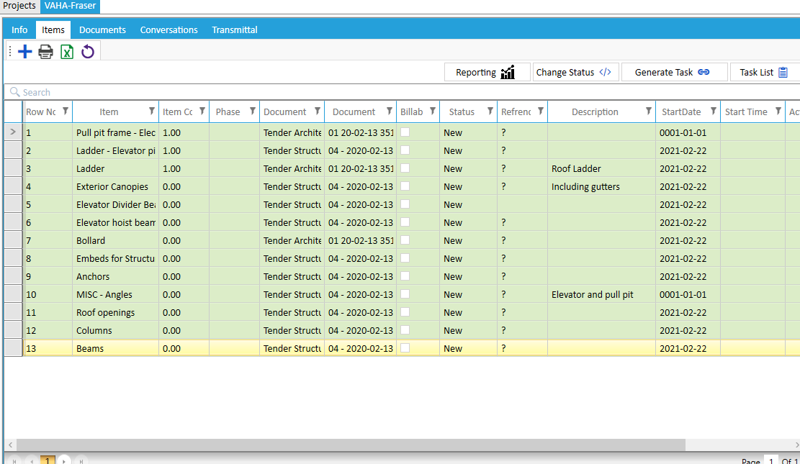

# Project Items

**Note:** Project items that a person or persons are responsible for doing.
The form fields are described below:

* Item Type
  Select Project Item Type from List. (Project Item Type in Administration/Project/Project Item Type is defined).
* Document Type
  Select Project Document Type from List. (Document Type in Administration/Project/Document Type is defined).
* Item Count

???

* Phase
  The phase of project is defined.
* Document
  Select Project Document from list.(Documents is defined to other tab);
* Refrences

؟؟؟

* Priority
 چرا غیر فعال است؟؟؟
؟؟؟

* Billabe
  If there is an additional cost other than the May cost in the project, it can be selected.
* Started Date
  The started date for project item.
* Started At
  The started houre for project item.
* Description
  The description of project item.

* Generate Task   
  Scheduled tasks for project items are specified in this section with base tamplate and displayed in the task list after storage.
  themplates is defined in the Administrator/Tasks/Action Chain Template.

 * Task List   
   In the task form the expected time , assigned to user , serverity ,  project item and etc ... is specified.

