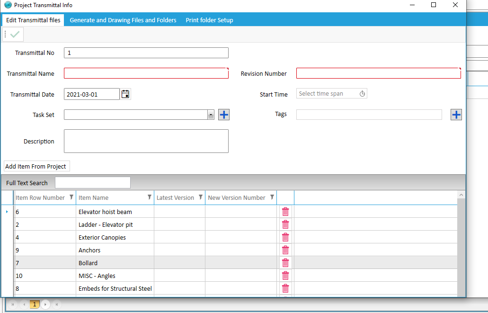

# Project Transmittal

**Note:** In The Transmittal Project Section Transmittal No, Revision ,Delivery Date , ... is specified.

* Get Transmittal Version

    The latest version of the drawing files is compressed and placed in the project path.
    
 * Generate Files

    The selected files and sub folders in Print folder is compressed and placed in the Transmittal Folder.

  * Archive Files

   The Selected Files in Print folder are moved to Drawing Files.

   * Create Print Folder

   The template of Folders which in Tekla Domain section is specified  with same structure create folders  in Print Folder.

