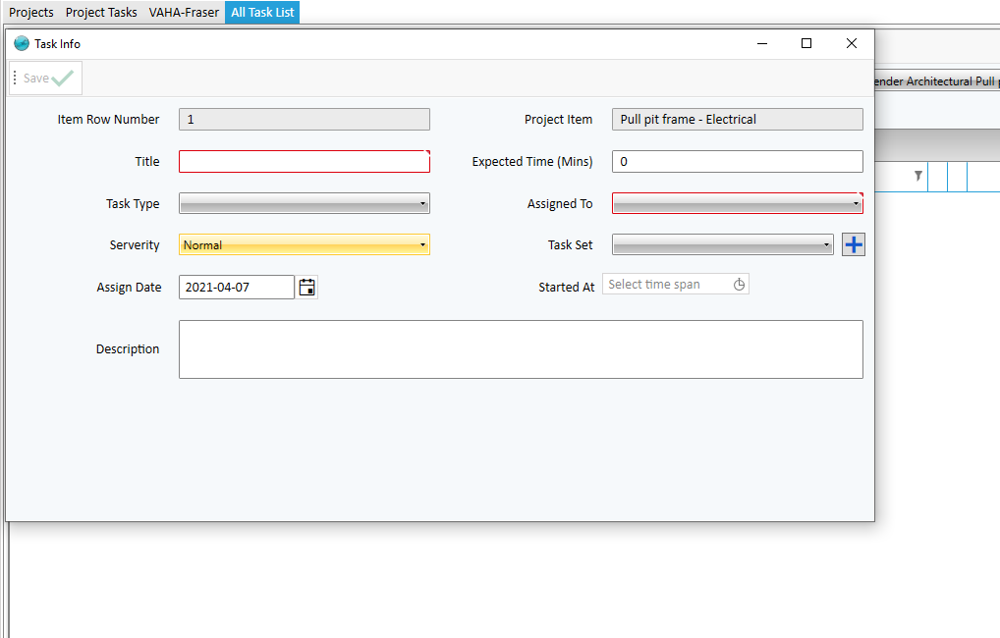

# Project Task
**Note:** Project files and documents in this section are physically stored in the domain path selected in the project.The form fields are described be

* Document Type
 Select Project Document Type from List. (Document Type in Administration/Project/Document Type is defined).
* Document Name
* Tags
  By specifying tags, it is easy to search for documents based on tags.
 * Recipt Date
   The reciept date for project documents. 
 * Recipt Time
   The reciept houre for project documents.   

