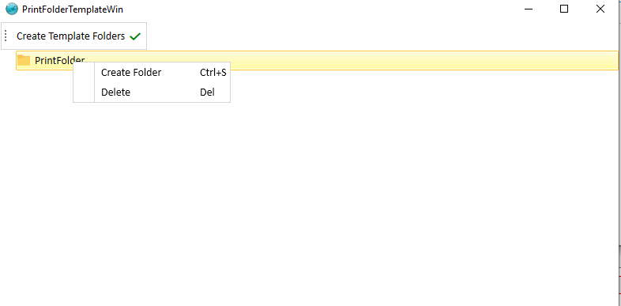

# Tekla Domain

**Note:** This form specifies the path to the physical files of the project as well as the structure of the files.
If a project is defined, it is not possible to delete or change the file path.

* Main Domain Folder

  The path to the physical files of the projects is defiend.

* Print Folder Template

  The structure of the files is defined According to the figure below

  
